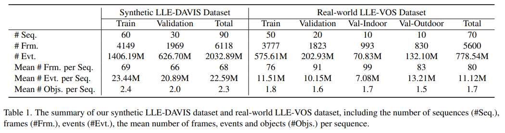

# [Event-assisted Low-Light Video Object Segmentation(CVPR 2024)](https://arxiv.org/pdf/2404.01945)


This is the repository for the [LLE-VOS Dataset](https://mailustceducn-my.sharepoint.com/:f:/g/personal/lihebei_mail_ustc_edu_cn/EglLfpidmBhKqVsOQS91SaQBCsQ21LP6wwjevJVL7fyDSQ).
## Overview
The LLE-VOS dataset includes 70 videos, consisting of paired normal and low-light videos, along with their corresponding segmentation annotations and event streams. The videos are recorded at a diverse range of locations, including gyms, playgrounds, classrooms, meeting rooms, and zoos.

## Dataset stats
The current version of the dataset contains:



## Download
To download the dataset, please click this [link](https://mailustceducn-my.sharepoint.com/:f:/g/personal/lihebei_mail_ustc_edu_cn/EglLfpidmBhKqVsOQS91SaQBCsQ21LP6wwjevJVL7fyDSQ). 

## Citation
If you use this data, please cite the following papers:

Li, Hebei, Jin Wang, Jiahui Yuan, Yue Li, Wenming Weng, Yansong Peng, Yueyi Zhang, Zhiwei Xiong, and Xiaoyan Sun. "Event-assisted Low-Light Video Object Segmentation." arXiv preprint arXiv:2404.01945 (2024).

```
@article{li2024event,
  title={Event-assisted Low-Light Video Object Segmentation},
  author={Li, Hebei and Wang, Jin and Yuan, Jiahui and Li, Yue and Weng, Wenming and Peng, Yansong and Zhang, Yueyi and Xiong, Zhiwei and Sun, Xiaoyan},
  journal={arXiv preprint arXiv:2404.01945},
  year={2024}
}
```


